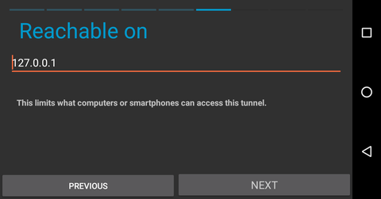

Unofficial semi-nightly F-Droid Repo
====================================

This is an UNOFFICIAL repository for development builds of i2p and i2p-bote on
Android.

What this is
------------

Turns out, pretty much all package manager repositories do pretty much the same
thing, which is basically host a bunch of static files and an index to help the
package manager client find the packages it want. To the server, it's all
static, the server doesn't have to do anything other than provide the files. So
putting up a binary repository is actually an extremely easy process that gives
you a great deal of flexibility on where and how you host the content.
Especially for repositories which are mostly managed by a single organization
with a small number of apps, where they can be updated all at once, it's not
even *actually* necessary to run fdroidserver or anything like that to make your
repo available. All you really need to do is re-generate the repository metadata
and transfer it to a server that will host the resulting static site.

Dependencies
------------

The applications you'll need are all in the fdroiserver package on Debian and
Ubuntu.

        sudo apt-get install fdroiserver

See also
--------

  * [F-Droid's own tutorial](https://f-droid.org/en/docs/Setup_an_F-Droid_App_Repo/)

Github Procedure
----------------

So to just shove an F-Droid repo into a github page, what you do is create a
github repository, enable github pages, and clone the repo. *Once you have*
*cloned the repository,* [**Before Anything Else** *download this .gitignore*](https://github.com/eyedeekay/repo/raw/master/.gitignore)
*into your repository directory*.

        wget -O .gitignore https://github.com/eyedeekay/repo/raw/master/.gitignore

Change directory
into the newly closed repo and type

        fdroid init

Which will obviously initialize your F-Droid repo locally. It creates keys and
a configuration file intended to be used together to manage releases on the
repository, these should *not* be included in the repository, hence the
.gitignore. Besides that, there is a file called config.py, which you should
alter to include your repository details, something like this:

        repo_url = "http://arajj5rcgaijhyafv7iklzpqmlibh4ugyuxmo6i2fekxcpb3zkca.b32.i2p"
        repo_name = "Unofficial I2P Dev Builds"
        repo_icon = "fdroid-icon.png"
        repo_description = """
        This is a repository of apps to be used with F-Droid. It contains the
        nightly development builds of I2P and I2P-Bote built by eyedeekay.
        """
        ### Do this to disable archiving of old builds.
        archive_older = 0

Then you take the APK
files that you want to host, and copy them into the 'repo' directory that was
created by ```fdroid init```. Once you have all your apk files in the repo
directory, run the command

        fdroid update --create-metadata

to generate the repository metadata. Now add the generated files to your git
repository:

        git add .
        DATE=$(date) git commit -am "added packages on $DATE"

and push them up to the page.

        git push origin master

Local Procedure
---------------

For hosting it locally I've used Docker, just because I'm a neat-freak mostly.
There's nothing stopping anyone from using any web server. Any and all HTTP
servers that exist should be capable of hosting an F-Droid repo, so pick a
simple one you're familiar with. For me, that's lighttpd.

#### TL:DR

With docker and make installed copy the Dockerfile, .dockerignore,
lighttpd.docker.conf, and Makefile from this repository into your F-Droid
repository directory. [*Please note that the **.dockerignore**](https://github.com/eyedeekay/repo/raw/master/.gitignore)*
*is as essential to the security of your repository as the previous .gitignore.*
Without it you will be serving both your keystore and your keystore password to
everyone. It is *strongly* advised that you remove these files entirely from
production servers(as I have on mine).

        wget -O Dockerfile https://github.com/eyedeekay/repo/raw/master/Dockerfile
        wget -O .dockerignore https://github.com/eyedeekay/repo/raw/master/.dockerignore
        wget -O lighttpd.docker.conf https://github.com/eyedeekay/repo/raw/master/lighttpd.docker.conf
        wget -O Makefile https://github.com/eyedeekay/repo/raw/master/Makefile

and run

        make

An index page will be created by parsing your README.md into an index.html
documen and a docker container will be built and started, forwarding lighttpd
to the host on port 3001. To change the port, edit lighttpd.conf

In order to use rsync to transfer the files to a production server via ssh, you
can use the command in lieu of the .dockerignore file

        rsync a -e ssh --exclude='*.ks,*.jks,*.keystore,*.crt,config.py,tmp,.git' $USER@$SERVER:$PATH

This will exclude the copying of sensitive data to the production server.

Forwarding to I2P
-----------------

Complete the local procedure.

From the host machine, navigate to the tunnel manager, at
127.0.0.1:7657/i2ptunnelmgr. At the top of the page, select "I2P Tunnel Wizard"
to begin the process.

 1. At the first menu, select a "Server Tunnel."
 2. At the next menu, select an "HTTP Tunnel."
 3. Give your tunnel a descriptive name, like "F-Droid Repo."
 4. Configure the server tunnel to forward traffic to the local F-Droid repo, which
  will probably be "127.0.0.1:3001."
 5. Select "Automatically start tunnel when router starts" and finish the wizard.

Your F-Droid repo will be available shortly.

Using Unofficial I2P repo from Android
--------------------------------------

If you want to use F-Droid to retrieve Android applications over i2p, you can
create a client tunnel pointed at the I2P mirror. Navigate to the tunnel page
in the I2P android application and take the following steps.

 1. Begin creating a client tunnel.


 2. Select a "Standard Tunnel" so we can point the tunnel at a specific
  destination.


 3. Name and Describe the tunnel.


 4. Set the tunnel destination to the value of the F-Droid repository.


 5. Set the tunnel to be available to other applications from the local host.



 6. Set the port you wish to use for the localhost address of the tunnel.


 7. Tell the tunnel to start when the I2P router starts


 8. Review the settings and finalize the tunnel.


 9. Configure your F-Droid client to use the local client tunnel as a
  repository.


